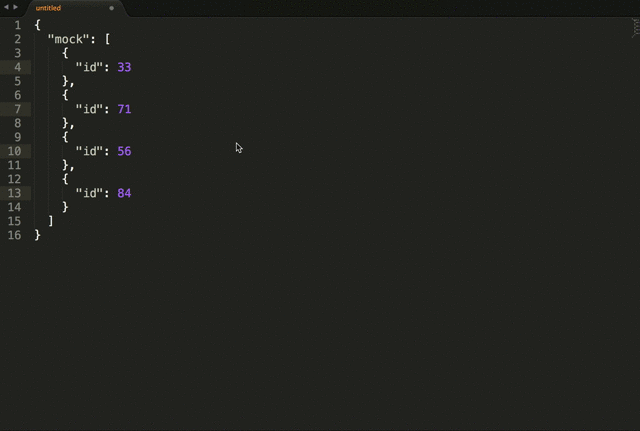

random-sublime-text-plugin
==========================

Plugin for sublime text to generate random, ints, floats, strings and words.

It works in Sublime Text 2 *and* ST3

Example
=======

Usage
=====

This plugin can only be accessed through the *cmd/ctrl + shift + p* command.

Type *random* and you get the following choices:

* Random:Int - requires a range from a-b separated with a: *-*. Default: 1-100
* Random:Float - requires a range from a-b separated with a: *-*. Default: 1-100
* Random:Letters - generatates a random string of lower and upper -case letters with a length between 3 and 17
* Random:Letters and numbers - generatates a random string of lower and upper -case letters and numbers with a length between 3 and 17
* Random:Word - picks a random word from /usr/share/dict/words
* Random:Text - picks 24 random words from /usr/share/dict/words
* Random:First name - picks a random first name from the built-in datafile
* Random:Last name - picks a random last name from the built-in datafile
* Random:Full name - picks a random full name from the built-in datafiles
* Random:E-mail - picks a random E-mail address
* Random:Url - generates a URL using random words from /usr/share/dict/words
